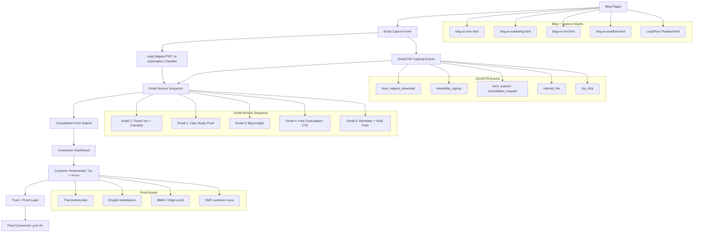

# LeadFlow Funnel Diagram

Mermaid diagram generated from current funnel assets:

- Blog pages + email capture forms
- Lead Magnet PDF: `AI Automation Checklist สำหรับ SME ไทย`
- GA4/GTM events: `lead_magnet_download`, `newsletter_signup`, `form_submit` / `consultation_request`
- Email sequence 1-5
- Customer testimonials: ไทย + อังกฤษ
- Conversion dashboard

## ROI-First Insight

- High impact: แสดงภาพรวม funnel ตั้งแต่ content, capture, nurture, proof, dashboard ไปจนถึง consultation
- Low effort: Mermaid render ได้ทันทีใน GitHub, docs, Notion หรือ Markdown viewer
- Smart 1% principle: diagram นี้ช่วยให้ทีมเห็นว่าทุก asset ทำหน้าที่อะไรใน conversion path

## Source Files

- `emails/sequence.md`
- `portfolio.html`
- `assets/js/conversion-tracking.js`
- `assets/lead-magnets/ai-automation-checklist-sme-th.pdf`
- `conversion-dashboard.md`
